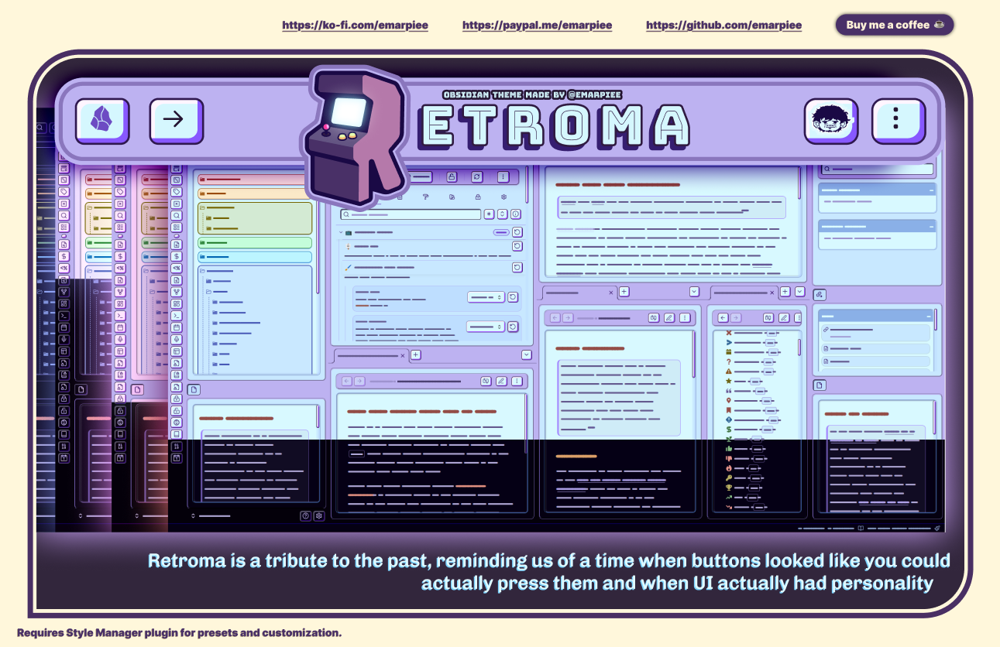
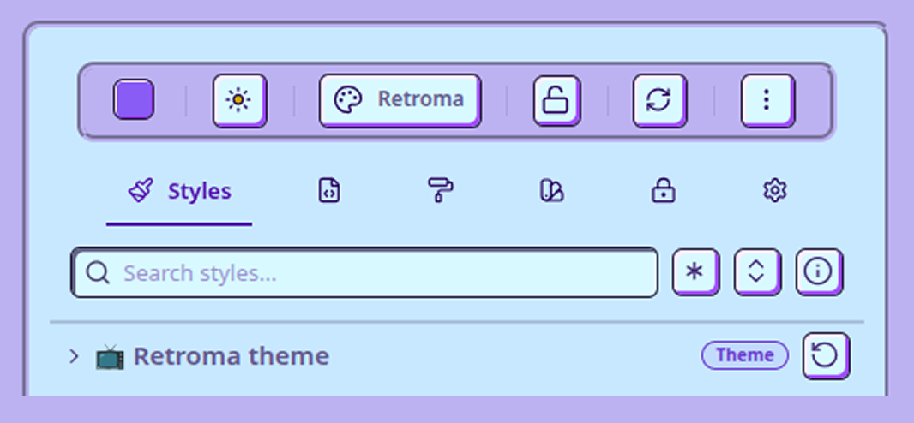
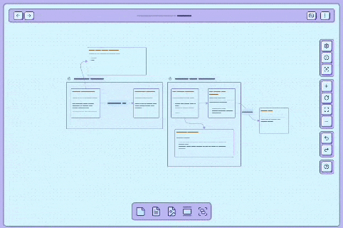
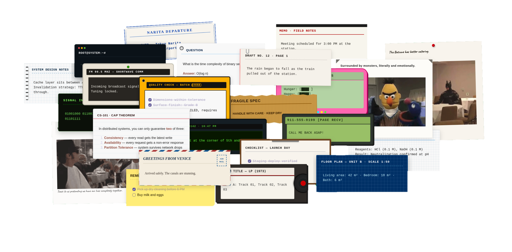

# Retroma Theme



Your notes are chaotic, your vault is a mess, and every modern theme looks the same. Retroma fixes that. It **draws inspiration from retro arcade machines, vintage software, and the early web**, bringing back actual tactile designs and personality. You don't need design skills to make it look good, either. Simply pick a single accent color and Retroma handles the rest of the palette automatically, protecting you from your own worst styling instincts.

## 🖌️ Style Manager



From simple visual tweaks to absolute control over every pixel, the [Style Manager plugin](https://community.obsidian.md/plugins/style-manager) acts as your bridge between casual styling and hardcore customization. Swap color schemes, choose from a selection of built-in retro fonts to apply globally or to specific parts like your markdown editor and canvas, push heading colors from muted to neon, fine-tune the corner roundness of your code blocks, or style your buttons to range from classic *skeuomorphism* to bold *neubrutalism*. You can even apply a vintage CRT scanline filter, go completely monochrome with a grayscale toggle, or strip away the clutter with Zen Mode to focus entirely on your writing. No judgment here, this is your chance to show off your inner perfectionist.

| Section                           | Description                                                                              | Specific Customizations                                                                                                                                                                                                                                                                                                                                                                                     |
| --------------------------------- | ---------------------------------------------------------------------------------------- | ----------------------------------------------------------------------------------------------------------------------------------------------------------------------------------------------------------------------------------------------------------------------------------------------------------------------------------------------------------------------------------------------------------- |
| **🖌️ Workspace and Panes**       | Shape your digital workspace.                                                            | Theme font selection, OKLCH color scheme & accent tuner, text color weights, window/sidebar borders, custom background/foreground color overrides.                                                                                                                                                                                                                                                          |
| **✍️ Markdown editor**            | Customize your primary markdown editor, behavior, and default formatting.                | Editor font selection, markdown editor background color and font size, simple editor header and container, readable line length, editor background patterns, blockquotes, callout box styling, alternative checkboxes, syntax highlighting, heading styling, links, lists, paragraph spacing, metadata properties, table borders, tags/pills, highlighter, text selection, strikethrough, horizontal rules. |
| **📦️ Button and inputs**         | Sculpt your buttons, customize input and touch interactions.                             | State transition animation speed, 3D button shadow & highlight properties for light & dark modes, color overrides (backgrounds, icons, borders).                                                                                                                                                                                                                                                            |
| **📊 Bases**                      | Configure cards and table view layouts.                                                  | Database-style table layout, cards view layout (cover color, borders, corner shapes), maps view popup colors.                                                                                                                                                                                                                                                                                               |
| **🔲 Canvas**                     | Adjust how you visualize your knowledge in canvas.                                       | Canvas floating UI (toggle, positions, fade delay, radius, spacing, background), canvas colors (background, grid dots, card background/borders), card and group corner roundness and border thickness.                                                                                                                                                                                                      |
| **📂 Folder and files**           | Adjust the visibility, structure, and general styling of the file explorer tree.         | Simple sidebar pane header and content, file item text wrapping, folder layout (radius, icon style, indentation lines, thickness), color overrides (rainbow text removal, text/bg colors, Folders 1–15 colors), file item styling.                                                                                                                                                                          |
| **⏹️ Popups**                     | Customize page preview, menu, modal and prompt popups.                                   | Custom hover page preview popups height and width, and modal backdrop dimming colors.                                                                                                                                                                                                                                                                                                                       |
| **📖 PDF**                        | Customize PDF viewer.                                                                    | Simple PDF viewer toggle, page background color, thumbnail sidebar background color, and thumbnail corner radius.                                                                                                                                                                                                                                                                                           |
| **☕️ Zen mode (desktop)**         | Focus on writing.                                                                        | Zen mode toggle, fade opacity, fade delay, custom background color overrides, and pinning controls (keep title bar, status bar, tabs, left sidebar, or right sidebar visible during Zen mode).                                                                                                                                                                                                              |
| **🎞️ Filters**                   | Modify the visual appearance of your screen with custom overlay effects.                 | Retro 8-bit pixelated icons, CRT screen effect (scanline thickness, inner/outer vignette colors), CRT text glow (toggle, brightness, glow size), grayscale toggles (force backgrounds, text, buttons, folder/files, images, or videos into black-and-white).                                                                                                                                                |
| **🔗 Backlink and search pane**   | Customize the layout and color styling of backlinks, outgoing links, and search results. | Search result match highlights, title text colors, search header/body background colors.                                                                                                                                                                                                                                                                                                                    |
| **🖥️ Desktop specific settings** | Customize tabs, title bar, status bar and scrollbar.                                     | Active/inactive tab radius and outline colors, window title bar active/inactive colors, status bar height/colors, scrollbar desktop width and thumb radius.                                                                                                                                                                                                                                                 |
| **📱 Mobile specific settings**   | Customize toolbar, sidebar, file navigation and scrollbar.                               | Simple bottom navigation bar toggle, mobile bottom toolbar background color, slide-out sidebar screen width (percentage), file explorer action buttons (top vs. bottom), mobile scrollbar thickness and thumb radius.                                                                                                                                                                                       |
| **🎲 Misc**                       | A collection of miscellaneous tools, extra and features.                                 | Toggle pre-designed retro callout blocks with fixed color schemes and classic styling.                                                                                                                                                                                                                                                                                                                      |
| **🧪 Plugin integrations**        | Plugin-specific styling.                                                                 |                                                                                                                                                                                                                                                                                                                                                                                                             |

## 🎨 Presets

If you’d rather skip the manual configurations, you can use and experiment with the sample presets below. Just download the bundle, import it into the Style Manager plugin, and apply your favorite style. You can even set schedules to switch styles automatically throughout the day, light and crisp by day, dark retro arcade by night.

### A. [How to Import the Presets](https://github.com/emarpiee/obsidian-style-manager#b-how-to-import-presets)

1. Download the [retroma-presets.json](assets/presets/retroma-presets.json) file.
2. Open **[Style Manager](https://community.obsidian.md/plugins/style-manager)** in Obsidian.
3. Click the **More Actions** menu (**⋮** three vertical dots) in the top toolbar.
4. Select **Import preset…**
5. Either click **Choose files** under "Import from files" to select the downloaded `.json` file, or paste the raw JSON text directly into the text box.
6. Hit **Import**. The presets will now appear under your **Presets** tab.

### B. [How to Apply a Preset](https://github.com/emarpiee/obsidian-style-manager#c-how-to-apply-a-preset)

1. Go to the **Presets** tab in Style Manager.
2. Click on the preset you want to use (like *Retroma: Newspaper* or *Retroma: Sweet Strawberry*).
3. Select **Apply > Apply to shared locker > Overwrite** to load the style onto your workspace.

### C. [How to Save Your Own Preset](https://github.com/emarpiee/obsidian-style-manager#a-how-to-save-your-own-preset)

1. After customizing your settings in Style Manager, go to the **Presets** tab.
2. Click **Create preset**.
3. Select which styles to include in your snapshot (like *Active theme*, *Appearance*, *Accent color*, or *Retroma theme* styles). You can also click **Select modified** to automatically check only your changes.
4. Click **Save preset** to store your custom setup for quick access later.

---


## Better Canvas

The floating UI elements in Canvas now automatically hides when panning or actively editing card content.



---
## Retroma Callouts

A collection of **79 styled callouts** for Obsidian, themed around vintage stationery, retro media hardware, photography, and academic materials.



### Basic Usage

Use the standard Obsidian callout syntax with any callout name from the table below:

```
> [!callout-name] Optional Title
> Your content goes here.
```

**Example:**

```
> [!polaroid-1] ROAD TRIP — OCT 1991
> Stopped at the diner near Route 66.
```

### Size Variants

Every callout supports three width sizes. Append `-s`, `-m`, or `-l` to the callout name:

| Suffix | Name   | Width  | Behaviour            |
| :----- | :----- | :----- | :------------------- |
| `-s`   | Small  | 320 px | Notepad / index-card |
| `-m`   | Medium | 520 px | Mid-width, centered  |
| `-l`   | Large  | 100%   | Full container width |

```
> [!notepad-s] Small
> Compact, centered.

> [!notepad-m] Medium
> Half-width, centered.

> [!notepad-l] Large
> Full width.
```

> Using a callout **without** a size suffix renders it at its own default width as defined in the CSS.

### Stickynote Colors

The `stickynote` callout comes in all seven rainbow colors. Combine the color name with an optional size suffix:

```
> [!stickynote-yellow] REMINDER
> Don't forget the milk.

> [!stickynote-red-s] URGENT
> Call back before noon.

> [!stickynote-blue-m] NOTE
> Mid-width blue sticky.
```

Available colors: `red` · `orange` · `yellow` · `green` · `blue` · `indigo` · `violet`

### Foldable Callouts

Add `+` (open by default) or `-` (closed by default) after the name:

```
> [!indexcard-m]+ Expandable
> Content is visible by default, click to collapse.

> [!flashcard]- Hidden answer
> Revealed only on click.
```

### Full Callout Reference

#### 📷 Photo-Film

| Callout | Description |
| :--- | :--- |
| `polaroid-1` | Classic white-border polaroid photo |
| `polaroid-2` | Polaroid variant with alternate styling |
| `film` | 35 mm film canister / roll |
| `filmstrip` | Film strip with frame borders |
| `negative` | Photographic film negative |
| `photoalbum` | Scrapbook-style photo album page |
| `photoslide` | Mounted slide transparency |
| `photomount` | Photo mount / corner-tab style |

#### 📼 Media-Hardware

| Callout | Description |
| :--- | :--- |
| `floppy` | 3½" floppy disk label |
| `cassette-1` | Cassette tape — variant 1 |
| `cassette-2` | Cassette tape — variant 2 |
| `vinyl` | Vinyl LP record sleeve |
| `reeltoreel` | Reel-to-reel tape recorder |
| `radio` | AM/FM radio broadcast |
| `transistor` | Transistor radio / shortwave |
| `eurorack` | Eurorack modular panel |
| `walkietalkie` | Walkie-talkie transmission |
| `calculator` | Vintage pocket calculator |
| `pager-1` | Numeric pager — variant 1 |
| `pager-2` | Numeric pager — variant 2 |
| `pagerunit` | Alphanumeric pager unit |
| `terminal` | Green-screen terminal |
| `matrixstream` | Matrix / data-stream display |
| `pcbboard` | PCB / circuit board |
| `tamagotchi` | Tamagotchi pet status screen |
| `punchedtape` | Punched paper tape |
| `marquee` | Arcade marquee header |
| `arcademarquee` | Full arcade cabinet marquee |
| `highscore` | High-score leaderboard |

#### 📝 Office-Stationery

| Callout | Description |
| :--- | :--- |
| `notepad` | Yellow lined notepad |
| `postcard-1` | Air mail postcard — variant 1 |
| `postcard-2` | Air mail postcard — variant 2 |
| `touristcard` | Tourist destination card |
| `artpostcard` | Art / museum postcard |
| `ticketstub` | Event ticket stub |
| `scrapbook` | Craft scrapbook page |
| `receipt-1` | Paper receipt — variant 1 |
| `receipt-2` | Paper receipt — variant 2 |
| `matchbook` | Hotel matchbook cover |
| `mailbox` | Vintage mailbox / letter |
| `indexcard` | 3×5 lined index card |
| `filingtab` | Filing folder with tab |
| `luggagetag` | Luggage / baggage tag |
| `krafttag` | Kraft paper gift tag |
| `duedate` | Library due-date slip |
| `visastamp` | Visa / entry stamp |
| `museumtag` | Museum object label |
| `toploader` | Card top-loader sleeve |
| `stickynote-red` | Sticky note — red |
| `stickynote-orange` | Sticky note — orange |
| `stickynote-yellow` | Sticky note — yellow |
| `stickynote-green` | Sticky note — green |
| `stickynote-blue` | Sticky note — blue |
| `stickynote-indigo` | Sticky note — indigo |
| `stickynote-violet` | Sticky note — violet |
| `legalpad` | Yellow legal pad |
| `gridnotebook` | Graph-paper notebook |
| `clipboard` | Clipboard with paper |
| `dailycalendar` | Daily desk calendar |
| `indextab` | Index / bookmark tab |
| `kraftpaper` | Kraft wrapping paper |
| `graphmemo` | Graph-paper memo |
| `library` | Library catalog card |
| `news` | Newspaper / broadsheet |

#### 🎓 Academics-Journaling

| Callout | Description |
| :--- | :--- |
| `compbook` | Composition book |
| `chalkboard` | Chalkboard / blackboard |
| `ruler` | Wooden ruler |
| `librarycard` | Library borrowing card |
| `flashcard` | Study flashcard |
| `labnotebook` | Lab / science notebook |
| `blueprint` | Technical blueprint |
| `fieldnote` | Field notes journal |
| `typewriter` | Typewritten manuscript page |
| `inspection` | Inspection / checklist form |

#### 🔖 Vintage-Stationery & Tactile Paper

| Callout | Description |
| :--- | :--- |
| `typewriter-page` | Typewriter page with paper clip detail |
| `vintage-ticket` | Vintage event / travel ticket (ADMIT ONE badge) |
| `passport-stamp` | Passport entry stamp with notched corners |
| `cardboard-cutout-shape` | Corrugated cardboard with torn top & bottom edges |

### Quick Reference Cheat Sheet

A ready-to-use file with one complete, copy-pasteable example of every callout is [here](https://github.com/emarpiee/Retroma/blob/main/assets/examples/retroma-retro-callouts.md).

---

## ⬇️ Retroma Installations

### Obsidian Community Theme

1. **Open Settings:** In Obsidian, click the gear icon in the bottom-left corner to open your settings.
2. **Go to Appearance:** From the left-hand sidebar, click on "Appearance."
3. **Manage Community Themes:** Look for the "Themes" section and click the "Manage" button. This will open up the community themes browser.
4. **Find Retroma:** In the search bar at the top, type "Retroma." The theme should appear in the list below.
5. **Install and Use:** Click on "Retroma" and then click the "Install and use" button. Obsidian will automatically download the theme and apply it to your vault.

### Manual

1. **Download the Theme:** First, download the [source code](https://github.com/emarpiee/Retroma/releases) for the theme.
2. **Extract the Files:** Unzip the downloaded folder to access its contents.
3. **Find Your Themes Folder:** Navigate to your Obsidian vault. Inside, look for the **`.obsidian/themes/`** directory.
4. **Create a New Theme Folder:** Inside the `themes` directory, create a new folder and name it **`Retroma`**.
5. **Move the Theme Files:** Copy the **`theme.css`** and **`manifest.json`** files from the unzipped download and place them into the new `Retroma` folder you just created.
6. **Restart and Apply:** Close and reopen Obsidian. Go to **Settings** > **Appearance** and select **Retroma** from the theme list to activate it.

---

## 🌱 Contribute to the Project

I welcome contributions of all kinds! If you're interested in helping out, please follow these guidelines.

### 🐞 Found a Bug?

1. Check the [issues](https://github.com/emarpiee/Retroma/issues) to see if the bug has already been reported.
2. If not, open a new issue. Please provide a clear title and a detailed description, including steps to reproduce the bug.

### 🔖 Want a New Feature?

1. Check the [issues](https://github.com/emarpiee/Retroma/issues) to see if the feature has already been requested.
2. If not, create a pull request or open a new issue and describe the feature you'd like to see.

## 🗃️ Resources

**Fonts used in the theme:**

- [Atkinson Hyperlegible](https://fonts.google.com/specimen/Atkinson+Hyperlegible)
- [Cascadia Code](https://fonts.google.com/specimen/Cascadia+Code)
- [Caveat](https://fonts.google.com/specimen/Caveat)
- [Courier Prime](https://fonts.google.com/specimen/Courier+Prime)
- [Excalifont](https://plus.excalidraw.com/excalifont)
- [Fraunces](https://fonts.google.com/specimen/Fraunces)
- [iA Writer Mono](https://github.com/iaolo/iA-Fonts/tree/master/iA%20Writer%20Mono)
- [Space Grotesk](https://fonts.google.com/specimen/Space+Grotesk)
- [Special Elite](https://fonts.google.com/specimen/Special+Elite)
- [VT323](https://fonts.google.com/specimen/VT323)
- [W95font](https://arnesava.github.io/w95font/)

---


## 📍 Note from the Developer

Retroma uses an algorithmic color system powered natively by CSS `oklch()`. Instead of relying on static hex codes, the theme dynamically calculates your entire palette, including background colors, foreground elements, and UI depth across dark and light modes directly from your chosen accent color.

### 🦚 Why Use OKLCH over HSL or RGB?

OKLCH is a modern CSS color space designed around how human eyes actually perceive color, rather than how computer screens generate it. Legacy formats like `hsl()` treat colors purely mathematically, meaning a 50% lightness yellow looks blindingly bright while a 50% lightness blue looks very dark.

OKLCH fixes these limitations through **perceptual lightness**: a lightness value of 60% appears equally bright to the human eye regardless of the hue. Because lightness remains uniform across all colors, creating accessible high-contrast UI design tokens, manipulating palettes, and building light/dark themes becomes purely mathematical, completely predictable, and dramatically easier.

For technical details, check out the official [W3C CSS Color Module Level 4 Specification](https://www.w3.org/TR/css-color-4/#ok-lab) or the [MDN Web Docs for oklch()](https://developer.mozilla.org/en-US/docs/Web/CSS/Reference/Values/color_value/oklch)

## ☕️ Buy Me A Coffee

Donations help me pay the bills, stay sane, and spoil my cat 🐱 Thanks for the support!

- [Ko-Fi Support](https://ko-fi.com/emarpiee)
- [PayPal Support](https://paypal.me/emarpiee)

---
*Retroma – Written with 💜, with passion, and with cats by my side.*
